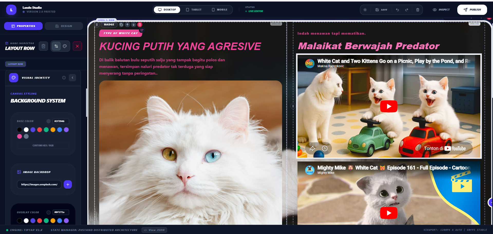

# ⚡ LANDO STUDIO: The Brutalist Web Revolution

<p align="center">
  
</p>

<p align="center">
  <b>High-Performance. Raw Aesthetics. Absolute Conversion.</b>
</p>

<p align="center">
  
  
  
  
</p>

<p align="center">
  <br />
  <b>🖥️ THE INTERFACE PREVIEW</b><br />
  <i>Experience the raw power of Brutalist Web Building</i>
</p>

<p align="center">
  
</p>

---

## 🚀 The Vision: Why Lando Studio?

In a digital era dominated by "safe" designs and identical SaaS templates, **Lando Studio** is the rebel. We don't just build websites; we build **Digital Statements**. 

### 💎 Key Pillars
- ⚡ **Lightning Fast:** Zero-latency rendering engine built on Tiptap.
- 📐 **Surgical Precision:** Strict node-based hierarchy ensures your layout never breaks.
- 🎨 **Raw Identity:** Bold skews and heavy typography that demand attention.
- 🛠️ **Industry Adaptive:** Pre-built kits for Weddings, Fintech, and High-Ticket Funnels.

---

## 📖 The "Founder's Story": From Frustration to Revolution

### The "Boring Web" Problem
Two years ago, we looked at the internet and saw a graveyard of creativity. Every landing page looked like it was made by the same algorithm. Rounded corners, soft blue buttons, and "friendly" illustrations had neutered the web. The soul of the internet—the raw, experimental energy of the early web—was dead.

### The Spark
We didn't want to build another "easy" website builder. We wanted to build a **power tool**. A tool that felt like a high-performance sports car: aggressive, precise, and unapologetically fast. We stripped away the bloat. We embraced **Brutalism**—the philosophy of raw materials and structural honesty. 

### The Evolution
Lando Studio was born in a small room with three monitors and a lot of coffee. We spent months perfecting the "Smart Redirect" logic so that a user could drag a complex section and have it snap into place with mathematical perfection. We realized that while the world needed "Bold," businesses needed "Results." So, we engineered adaptive kits that translated our brutalist energy into high-converting funnels and elegant event pages.

---

## 💼 Investor Pitch: The Open Source Powerhouse

### The Opportunity
The "No-Code" market is projected to reach **$187 Billion by 2030**. However, the current players (Webflow, Wix, Framer) are becoming increasingly expensive, closed-source, and complex. 

**Lando Studio is the Disruptor.** 

By moving to an **Open Source** model, we are not just building a product; we are building an **Ecosystem**. We are inviting the world's best developers to build "Lando Extensions," "Lando Themes," and "Lando Plugins."

### Why Invest?
1.  **Viral Growth:** Open source projects like Supabase and Vercel have proven that developer adoption is the strongest moat.
2.  **Scalable Revenue:** Our future roadmap includes a "Lando Cloud" for hosting and a "Lando Pro" marketplace for premium industry kits.
3.  **Untapped Niche:** We own the "Brutalist/High-Conversion" niche. While others go soft, we go bold.
4.  **Developer-First:** Built on Tiptap (Prosemirror), we have the most extensible editor architecture on the market.

**Join us in reclaiming the web. Let’s make the internet exciting again.**

---

## 🛠 Tech Stack & Architecture

- **Core:** React 18 + TypeScript
- **Engine:** Tiptap / Prosemirror (Node-based structured editing)
- **Styling:** Tailwind CSS (Optimized utility-first styling)
- **Animation:** Framer Motion (Smooth, physics-based interactions)
- **Persistence:** IndexedDB via Dexie.js (Offline-first capability)

## ✨ Core Features: The Lando Edge

### 🎨 Next-Gen Visual Builder
- **Smart Drag & Drop:** Context-aware placement with real-time visual indicators (Lines and Ghost Boxes).
- **Responsive Mastery:** Instantly toggle between **Desktop, Tablet, and Mobile** viewports to ensure perfection across all devices.
- **Inspect Mode:** A clean, distraction-free environment to preview your creation exactly as it will appear live.
- **Glassmorphism Drag Ghost:** Premium visual feedback that makes building feel like a high-end experience.

### 🧱 Brutalist Component Library
- **Layout Engine:** Nested Row & Column system for infinite structural flexibility.
- **Ready-to-Convert Sections:** Pre-built Hero sections, Feature grids, Pricing tables, Testimonials, and Footers.
- **Atomic Elements:** Precision-tuned Buttons, Icons, Images, Videos, Forms, Dividers, and Spacers.

### ⚡ Performance & Persistence
- **Zero-Latency Engine:** Built on Tiptap 2.x for a fluid, lag-free editing experience.
- **Offline-First Persistence:** Your work is automatically synced to **IndexedDB** (via Dexie.js), ensuring zero data loss even if the browser closes.
- **Intelligent Auto-Save:** Debounced background syncing with real-time "System Status" notifications.

### 🌈 Global Design System
- **Theme Presets:** Instant visual pivots with presets like **Frosted, GenZ, Bootstrap, and Material**.
- **Dark Mode Native:** Full support for Light and Dark modes with a single toggle.
- **Variable-Driven:** Entirely powered by CSS variables for deep, effortless customization.

## 🚦 Getting Started for Contributors

We believe in the power of the community. Here is how you can jump in:

```bash
# Clone the revolution
git clone https://github.com/your-repo/lando-studio.git

# Install the engine
npm install

# Ignite the development server
npm run dev
```

## 📜 Project Guidelines
Detailed development standards and UI/UX laws are maintained in `GEMINI.md`.

---
<p align="center">
  <i>"Don't just build a site. Build a legacy."</i><br>
  <b>— The Lando Studio Team</b>
</p>
